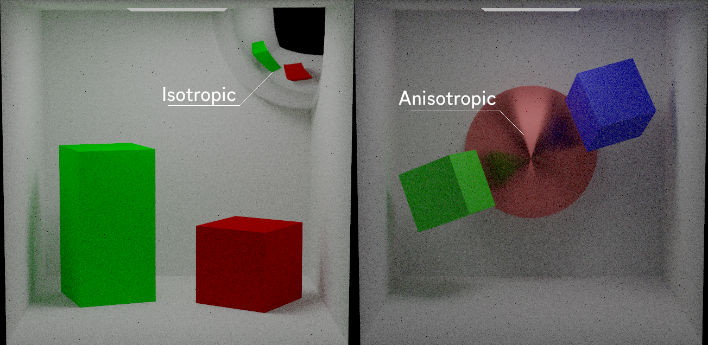
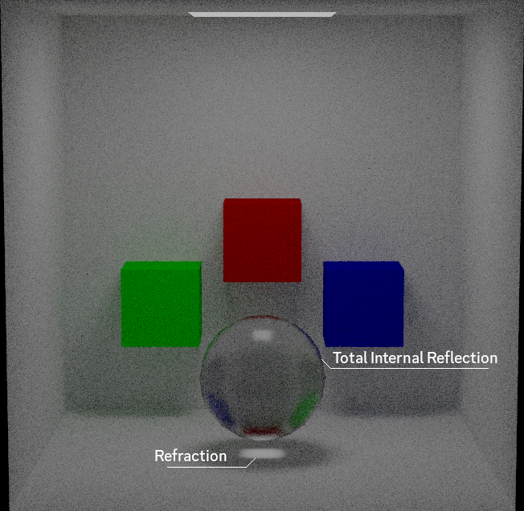
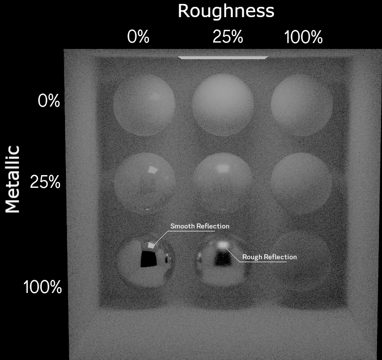
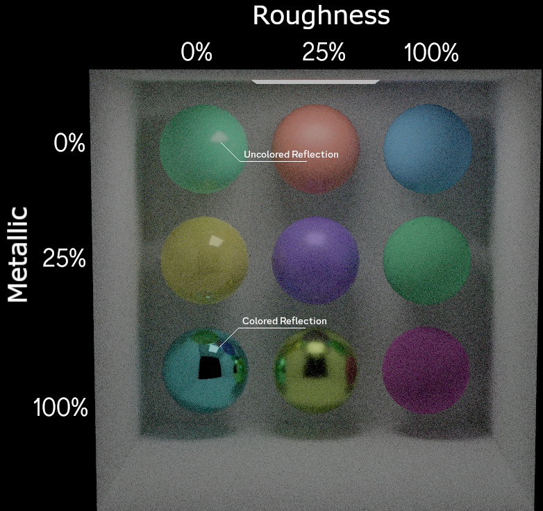
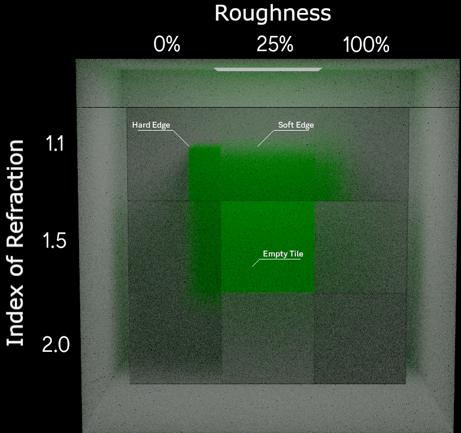

Path Tracer
===========

  

A Monte Carlo Path Tracer using OpenGL. Current supported material properties include: base color, roughness, metallic, anisotropy, transmission, and index of refraction.

  

  

  

  

  

References
---
[Physically Based Rendering - Matt Pharr, Wenzel Jakob, and Greg Humphreys](https://pbr-book.org/)
